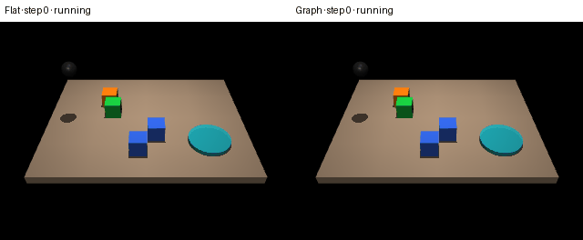
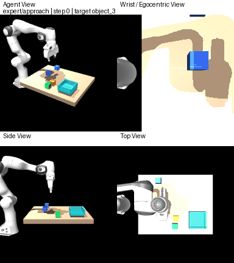

# Interaction-Structured VLA

这个项目当前验证一个最小而明确的 representation hypothesis：

> 在物理状态信息、source episode、共享 H=8 时序头、优化预算和 rollout
> controller 完全相同的条件下，显式 interaction Graph encoder 是否比 canonical
> Flat encoder 更容易学到 gripper-aware、object-aware 操作策略？

它目前是一个受控的 state-based behavior cloning 实验，不是 world model，也不要求把 VLA 路线替换掉。Flat 与 Graph 使用相同的示范、动作头、优化器、随机种子、闭环评估场景与近似相同的参数预算；主要差别只在场景表示。后续可以把验证过的 Graph adapter 接入 VLA。



上图是固定的 crowded-OOD case（环境 seed `2140049`、4 个物体、recovery 模型 seed `0`）：Flat 在 120 步后超时，Graph 在 29 步成功。绿色是目标物体，橙色是离目标最近的干扰物，蓝色是其他物体。单个案例只用于理解行为，定量结论以完整的三随机种子评估为准。

## 既有结果与当前结论边界

下面的 Stage B 数字来自旧 kinematic/recovery 实验，不是当前真实接触物理 v3
的结论。Stage B 的 crowded-OOD Graph−Flat 三随机种子成功率差为
`+25.0 / -2.5 / +5.0` 个百分点，平均 `+9.17` 个百分点，因此它也
**没有证明统一的 Graph > Flat 闭环成功率优势**。当前 v3 必须以新生成的
`interaction_chunk_pilot/evaluation/report.json` 为准；在该报告产生前不声称 Graph 获胜。

更清晰的信号来自 object awareness：crowded-OOD wrong-object rate 为 Graph `2.5%`、Flat `29.2%`。打乱 Graph 的有效边后，三个种子的 crowded 成功率都降为 `0%`，说明策略确实使用了交互关系，而不只是增加了参数。

完整结果见 [实验报告](docs/interaction_graph_pilot_results.md)，机器可读结果位于：

- `outputs/interaction_vla/pilot/evaluation/`
- `outputs/interaction_vla/crowded_baseline/evaluation/`
- `outputs/interaction_vla/recovery/evaluation/`

## 推荐实验：真实接触物理 v3

v3 把 action chunking、short-horizon sequence prediction、六维 Cartesian
exponential smoothing、gripper hysteresis、IK projection、expert gate 和 recovery
generation 都定义为 Flat/Graph 共享基础设施，不把 temporal head 或 recovery
augmentation 当作贡献。唯一方法变量是 encoder。

数据按 source seed 划分，而不是随机 trajectory 划分。Pilot 采集 200 条 base
demonstration，固定形成 160/20/20 的 train/validation/test source split；只从 25%
的 train source 生成训练 recovery，并使 recovery 恰好占每个训练 batch 的 25% loss
mass。validation/test recovery 只作为 `heldout_recovery` benchmark，不进入训练。

主结论先看 `primary_interaction`：目标是否是第一次接触的物体、target bilateral
contact、stable target grasp/lift、grasp-given-contact、稳定抓取持续时间、wrong-object
interaction、drop 和 transport progress。`secondary_task` 再看 strict in-box
placement、release + retreat 和完整 strict task success。物体必须完全位于盒内并接触
底面；只碰盒壁不算放置成功。

代码、场景或 controller 更新会令旧 expert gate 主动失效。本次 v3 实现新增 strict
placement 和 learned-rollout provenance，因此必须从第一条命令重新运行。以下所有耗时
的非交互命令都自带 tqdm：

```bash
.venv/bin/python -m interaction_vla.validate_physics_expert \
  --config configs/physics_interaction_chunk_pilot_macos.yaml

.venv/bin/python -m interaction_vla.physics_data collect \
  --config configs/physics_interaction_chunk_pilot_macos.yaml

.venv/bin/python -m interaction_vla.train \
  --config configs/physics_interaction_chunk_pilot_macos.yaml \
  --representation flat \
  --model-seed 0

.venv/bin/python -m interaction_vla.train \
  --config configs/physics_interaction_chunk_pilot_macos.yaml \
  --representation graph \
  --model-seed 0

.venv/bin/python -m interaction_vla.physics_evaluate \
  --config configs/physics_interaction_chunk_pilot_macos.yaml \
  --model-seeds 0 \
  --conditions id_normal heldout_recovery \
  --episodes-per-count 5
```

评估输出包括 `evaluation/report.json`、逐 episode 的 `episodes.csv`，以及逐 learned
policy step 的 `action_diagnostics.jsonl`。报告保存 action trace 的相对路径和 SHA-256，
并明确使用 Graph-minus-Flat 的 paired delta 符号约定。v3 默认只评估
`id_normal` 和 `heldout_recovery`；OOD 与 edge shuffle 需要显式请求。

实时查看 Graph rollout：

```bash
.venv/bin/python -m interaction_vla.physics_visualize dashboard \
  --config configs/physics_interaction_chunk_pilot_macos.yaml \
  --controller graph \
  --checkpoint outputs/interaction_graph_physics/interaction_chunk_pilot/graph/seed_0/checkpoint.pt \
  --layout crowded \
  --object-count 3 \
  --seed 2140049
```

导出同初始状态的 Flat/Graph 双侧四画面 GIF：

```bash
.venv/bin/mjpython -m interaction_vla.physics_visualize export-comparison-gif \
  --config configs/physics_interaction_chunk_pilot_macos.yaml \
  --flat-checkpoint outputs/interaction_graph_physics/interaction_chunk_pilot/flat/seed_0/checkpoint.pt \
  --graph-checkpoint outputs/interaction_graph_physics/interaction_chunk_pilot/graph/seed_0/checkpoint.pt \
  --layout crowded \
  --object-count 3 \
  --seed 2140049 \
  --output docs/media/interaction_chunk_flat_vs_graph.gif
```

macOS 若再次出现 `libpython3.12.dylib` 错误，先运行本 README 安装段中的
`.venv/bin/python -m interaction_vla.macos_mjpython`；它只修复 `.venv/lib` 链接，
不会删除缓存或重建环境。

### LeRobot 双视角数据与 ACT smoke

这个桥接使用独立的 Python 环境，不升级项目原有 `.venv`：

```bash
python3.12 -m venv .venv-lerobot
.venv-lerobot/bin/python -m pip install -r requirements-lerobot-macos.txt

.venv-lerobot/bin/python -m interaction_vla.lerobot_bridge collect \
  --config configs/lerobot_act_smoke_macos.yaml
.venv-lerobot/bin/python -m interaction_vla.lerobot_bridge validate \
  --config configs/lerobot_act_smoke_macos.yaml
.venv-lerobot/bin/python -m interaction_vla.lerobot_bridge smoke \
  --config configs/lerobot_act_smoke_macos.yaml
```

生成 ACT 闭环双视角 GIF：

```bash
.venv-lerobot/bin/python -m interaction_vla.lerobot_bridge rollout \
  --config configs/lerobot_act_smoke_macos.yaml \
  --checkpoint outputs/lerobot/act_smoke/checkpoint \
  --object-count 2 \
  --gif outputs/lerobot/act_smoke/rollout.gif
```

GIF 展示实际送入 ACT 的 agent/wrist RGB 和执行状态。500-step checkpoint
只通过工程 smoke；GIF 中的 timeout 或失败状态不是任务性能成功证据。

标准 LeRobotDataset 样本只有 agent RGB、wrist RGB、10D 末端状态、7D
局部动作和 task metadata。深度、分割、相机矩阵与 TC-TIG 标签只存在于
`teacher/` sidecar，ACT 和 VLA 的标准 batch 不会读取它们。

首个数据集使用一条固定语言指令，用来验证 language-conditioned dataset
兼容性；ACT 本身不使用语言。设备在进程启动时探测：MPS 可用则使用 MPS，
否则回退 CPU。5 个 episode 与 500-step 训练只验证工程闭环，不构成任务性能
或语言泛化证据。所有命令仅写本地 Hugging Face 兼容数据和 checkpoint，当前
CLI 不提供 Hub upload。

## Mac 安装

已针对 macOS / Apple Silicon 使用 Python 3.12、MuJoCo 3.3.4 测试：

```bash
uv venv --python 3.12
source .venv/bin/activate
uv pip install -r requirements-macos.txt
.venv/bin/python -m interaction_vla.macos_mjpython
```

最后一条命令修复 uv Python 与 macOS `mjpython` 的动态库路径：它在
`.venv/lib` 中建立一个指向 uv 自带 `libpython3.12.dylib` 的符号链接，
不会复制动态库，也不会覆盖冲突文件。每次重建 `.venv` 后运行一次即可。
`device: auto` 会优先使用可用的 MPS，否则回退到 CPU。

## 真实 Franka 接触物理（新）

这一条链路使用完整 Franka Panda、双指夹爪与 7D Cartesian delta pose action：
`[Δx, Δy, Δz, Δrx, Δry, Δrz, gripper]`。MuJoCo 以 500 Hz 运行，policy
以 20 Hz 输出动作，每个动作执行 25 个 simulation substeps。物体只有 free joint，
抓取完全来自双指碰撞、摩擦、接触力与重力；rollout 中没有 suction、weld 或物体
`qpos` 修改。



上图由物理 expert 在 crowded 4-object case 中直接导出。四个同步画面依次是
Agent、Wrist/Egocentric、Side、Top；绿色为目标、橙色为最近干扰物、蓝色为其他物体。

### 四画面 viewer

macOS 上，自建 GLFW 四画面窗口必须由普通 Python 主线程启动；`mjpython` 会把
Python 放到辅助线程并导致 AppKit 拒绝创建窗口。只有下面的 MuJoCo 原生 `native`
subcommand 使用 `mjpython`。GIF 是离屏渲染，也可安全使用 `mjpython`。

```bash
.venv/bin/python -m interaction_vla.physics_visualize dashboard \
  --controller expert --layout crowded --object-count 4 --seed 2140049
```

完整的 7D keyboard teleoperation 使用 `WASD` 控制 xy、`R/F` 控制 z、方向键控制
rx/ry、`Q/E` 控制 rz、空格切换双指开合、`Z` 丢弃并重置、`Esc` 退出。下面的命令
同时保存四视角同步 RGB-D：

```bash
.venv/bin/python -m interaction_vla.physics_visualize teleop \
  --layout normal --object-count 3 --seed 2140049 --record outputs/teleop_demo.npz
```

也可以打开 MuJoCo 原生三维 viewer：

```bash
.venv/bin/mjpython -m interaction_vla.physics_visualize native \
  --controller expert --layout crowded --object-count 4 --seed 2140049
```

Flat 或 Graph checkpoint 使用相同 viewer，只需改 controller 并提供物理 checkpoint：

```bash
.venv/bin/python -m interaction_vla.physics_visualize dashboard \
  --controller graph \
  --checkpoint outputs/interaction_graph_physics/smoke/graph/seed_0/checkpoint.pt \
  --layout crowded --object-count 4 --seed 2140049
```

### 导出四画面 GIF

```bash
.venv/bin/mjpython -m interaction_vla.physics_visualize export-gif \
  --controller expert --layout crowded --object-count 4 --seed 2140049 \
  --output docs/media/franka_contact_expert.gif
```

导出同初始状态的 Flat/Graph 双侧四画面对比：

```bash
.venv/bin/mjpython -m interaction_vla.physics_visualize export-gif \
  --controller expert --layout crowded --object-count 4 --seed 2140049 \
  --flat-checkpoint outputs/interaction_graph_physics/smoke/flat/seed_0/checkpoint.pt \
  --graph-checkpoint outputs/interaction_graph_physics/smoke/graph/seed_0/checkpoint.pt \
  --output docs/media/franka_contact_flat_vs_graph.gif
```

### 物理 smoke 实验

正式数据采集之前必须先通过独立 expert gate；门禁文件会绑定 config、scene 和
controller 哈希，任何一项变化后旧门禁都会被拒绝：

```bash
.venv/bin/python -m interaction_vla.validate_physics_expert \
  --config configs/physics_smoke_macos.yaml
.venv/bin/python -m interaction_vla.physics_data collect \
  --config configs/physics_smoke_macos.yaml \
  --expert-gate outputs/interaction_graph_physics/smoke/expert_gate.json
.venv/bin/python -m interaction_vla.train \
  --config configs/physics_smoke_macos.yaml --representation flat
.venv/bin/python -m interaction_vla.train \
  --config configs/physics_smoke_macos.yaml --representation graph
.venv/bin/python -m interaction_vla.physics_evaluate \
  --config configs/physics_smoke_macos.yaml
```

smoke 配置只含 4 条 demonstration、训练 1 epoch，用来验证 7D/18D/23D 数据、训练、
配对评估和 edge-shuffle 管线，不用于声称 Graph 优于 Flat。Pilot 配置要求 normal 和
crowded expert 分别达到至少 90% 后，才采集 50 条数据并训练三个模型种子。

确定性物理 recovery augmentation 使用单独配置，避免覆盖无 augmentation 的基线。
每个 training-split source episode 固定生成三次 post-grasp 尝试：
`wrong_way_transport`、`premature_open`、`receptacle_misalignment`。扰动前的
approach/grasp 前缀不会写入 recovery 文件，只有干预后的专家纠正段参与训练；
validation/test seed 不会生成 recovery。

这次修改改变了 controller provenance 和配置哈希，因此此前的 expert gate、数据、
checkpoint 与 evaluation report 都不能继续使用。先用 smoke 配置验证完整链路：

```bash
.venv/bin/python -m interaction_vla.validate_physics_expert \
  --config configs/physics_recovery_smoke_macos.yaml
.venv/bin/python -m interaction_vla.physics_data collect \
  --config configs/physics_recovery_smoke_macos.yaml
.venv/bin/python -m interaction_vla.train \
  --config configs/physics_recovery_smoke_macos.yaml --representation flat
.venv/bin/python -m interaction_vla.train \
  --config configs/physics_recovery_smoke_macos.yaml --representation graph
.venv/bin/python -m interaction_vla.physics_evaluate \
  --config configs/physics_recovery_smoke_macos.yaml
```

完整版本对应 `configs/physics_recovery_pilot_macos.yaml`。

只重新训练和评估模型 seed 0 时，运行：

```bash
.venv/bin/python -m interaction_vla.validate_physics_expert \
  --config configs/physics_recovery_pilot_macos.yaml

.venv/bin/python -m interaction_vla.physics_data collect \
  --config configs/physics_recovery_pilot_macos.yaml

for representation in flat graph; do
  .venv/bin/python -m interaction_vla.train \
    --config configs/physics_recovery_pilot_macos.yaml \
    --representation "$representation" \
    --model-seed 0
done

.venv/bin/python -m interaction_vla.physics_evaluate \
  --config configs/physics_recovery_pilot_macos.yaml \
  --model-seeds 0 \
  --episodes-per-count 5
```

如果只想先判断 seed 0 在训练分布内是否具备基本控制与抓取能力，使用独立输出，
避免覆盖完整评估报告：

```bash
.venv/bin/python -m interaction_vla.physics_evaluate \
  --config configs/physics_recovery_pilot_macos.yaml \
  --model-seeds 0 \
  --episodes-per-count 5 \
  --conditions id_normal \
  --output outputs/interaction_graph_physics/recovery_pilot/evaluation/id_sanity_report.json
```

learned Flat/Graph rollout 默认使用确定性的 IK action projection：当原始 7D action
不可达时，按 `1.0, 0.5, 0.25, 0.125, 0.0` 依次缩放六维末端位姿增量，gripper
命令保持不变。报告会记录 action saturation、projection 比例、零位姿 projection、
平均 projection scale 和 termination reason；`learned_policy_sanity` 分开报告控制
sanity 与是否真正发生 stable lift。要复现旧的原始 policy rollout，可添加
`--disable-ik-projection`。Graph/Flat viewer 和 GIF 也使用同一逻辑，并在 learned
controller 的 overlay 中显示当前 `IK scale`。

以上四个阶段的 CLI 都会自动显示 `tqdm`：expert gate 按 validation case
推进；数据采集先按成功写入的 base episode 推进，再按每个 recovery attempt
推进；Flat/Graph 训练按 epoch 推进；物理评估按 rollout 推进。base episode 被拒绝时
进度数值不会虚增，但右侧会更新 attempts、accepted、rejected 和 reason，因此不是卡住。

上面的快速评估只运行 Flat 与 Graph：8 个 condition/object-count 组合 × 每组 5 个
episode × 2 个 policy，共 80 个 rollout。省略 `--episodes-per-count 5` 会使用 pilot
配置的每组 20 个 episode，共 320 个 Flat/Graph rollout。只有需要结构消融时才添加
`--include-edge-shuffle`；此时快速评估为 120 个、完整评估为 480 个 rollout。
默认评估会覆盖 `evaluation/episodes.csv` 和 `evaluation/report.json`；传入
`--output <output_dir>/evaluation/some_name.json` 后，会改为写入该 JSON 和同目录的
`some_name_episodes.csv`。自定义路径必须位于当前实验的 `evaluation/` 目录，且不能
显式指定默认 `report.json`，从而不会碰 expert gate、manifest、默认报告、数据或
checkpoint。

`physics_data collect` 会重新写入 manifest、rejection log 和同名 episode/recovery
文件，但不会删除输出目录内其他名称的 checkpoint、GIF 或报告。建议在重新训练前
检查 `recovery_manifest.json` 与 `recovery_rejections.json` 中三类 intervention 的
接受/拒绝数量。

### 历史实验：Terminal release-and-retreat 数据 v2

seed-0 ID sanity 暴露了一个明确的终止失败：Graph 可以把物体稳定放进 receptacle，
但随后重新闭合夹爪，并且没有完成向上撤离。v2 数据同时修正两个问题：collector
现在在调用 `expert.act()` 之前记录 action phase，避免 phase transition 导致标签错位；
每个训练 source 还增加第四类 `post_placement_reclose` recovery。该干预通过真实
Cartesian control 将已释放的夹爪闭合并下降五步，随后只记录 expert 的重新打开和
向上撤离纠正段，不修改物体 qpos。

新实验使用独立目录
`outputs/interaction_graph_physics/terminal_recovery_pilot/`，不会覆盖旧
`recovery_pilot` 数据或报告。数据采集还会生成 `recovery_quality.json`；pilot 要求
四类 recovery 各自至少 80% 接受率；缺失整类或零尝试也会明确写入并使质量门失败。
intervention 内出现 IK 限制或物理故障时，rejection log 会保留具体 subtype。由于数据
生成源码和配置都改变，必须建立新的 expert gate 并重新采集，旧 checkpoint 不能混入
新实验。

完整 seed-0 流程如下，所有耗时阶段都有 tqdm：

```bash
.venv/bin/python -m interaction_vla.validate_physics_expert \
  --config configs/physics_terminal_recovery_pilot_macos.yaml

.venv/bin/python -m interaction_vla.physics_data collect \
  --config configs/physics_terminal_recovery_pilot_macos.yaml

for representation in flat graph; do
  .venv/bin/python -m interaction_vla.train \
    --config configs/physics_terminal_recovery_pilot_macos.yaml \
    --representation "$representation" \
    --model-seed 0
done

.venv/bin/python -m interaction_vla.physics_evaluate \
  --config configs/physics_terminal_recovery_pilot_macos.yaml \
  --model-seeds 0 \
  --episodes-per-count 5 \
  --conditions id_normal \
  --output outputs/interaction_graph_physics/terminal_recovery_pilot/evaluation/id_sanity_report.json
```

先检查 ID 报告中的 `success_rate`、`placement_rate` 和
`post_placement_reclose_rate`。只有出现真实 success 后才继续 crowded OOD；本阶段
没有 learned-rollout 的 scripted release/retreat override。

## 旧 Kinematic baseline 可视化（保留）

旧 `interaction_vla.visualize` 命令仍然保留，用于复现抽象 gripper 的 kinematic
baseline；真实 Panda/contact 系统请使用上面的 `interaction_vla.physics_visualize`。
macOS 原生 MuJoCo viewer 必须通过 `mjpython` 启动。先看旧 scripted expert：

```bash
.venv/bin/mjpython -m interaction_vla.visualize viewer \
  --controller expert \
  --layout crowded \
  --object-count 4 \
  --seed 2140049
```

查看真实 Graph checkpoint：

```bash
.venv/bin/mjpython -m interaction_vla.visualize viewer \
  --controller graph \
  --checkpoint outputs/interaction_vla/recovery/graph/seed_0/checkpoint.pt \
  --layout crowded \
  --object-count 4 \
  --seed 2140049
```

确定性 recovery 可视化只用于 expert controller；支持 `align_offset`、`failed_close`、`lift_offset` 和 `transport_offset`：

```bash
.venv/bin/mjpython -m interaction_vla.visualize viewer \
  --controller expert \
  --layout crowded \
  --object-count 4 \
  --seed 2140049 \
  --recovery-kind failed_close
```

## 导出 Flat / Graph 对比 GIF

在普通 macOS Terminal 图形会话中运行：

```bash
.venv/bin/python -m interaction_vla.visualize export-gif \
  --flat-checkpoint outputs/interaction_vla/recovery/flat/seed_0/checkpoint.pt \
  --graph-checkpoint outputs/interaction_vla/recovery/graph/seed_0/checkpoint.pt \
  --layout crowded \
  --object-count 4 \
  --seed 2140049 \
  --max-steps 120 \
  --fps 12 \
  --width 320 \
  --height 240 \
  --output docs/media/flat_vs_graph_crowded.gif
```

两侧 rollout 使用同一个初始场景与环境 seed；某一侧提前结束时会保持最终状态，直到另一侧结束。运行 `python -m interaction_vla.visualize --help` 可查看全部参数。

## 最小实验流程

先用 smoke 配置验证数据、训练和评估链路：

```bash
.venv/bin/python -m interaction_vla.data collect --config configs/smoke_macos.yaml
.venv/bin/python -m interaction_vla.train --config configs/smoke_macos.yaml --representation flat
.venv/bin/python -m interaction_vla.train --config configs/smoke_macos.yaml --representation graph
.venv/bin/python -m interaction_vla.evaluate \
  --config configs/smoke_macos.yaml \
  --checkpoints \
  outputs/interaction_vla/smoke/flat/seed_0/checkpoint.pt \
  outputs/interaction_vla/smoke/graph/seed_0/checkpoint.pt
```

`smoke_macos.yaml` 只跑 3 个 epoch，用于检查安装，不用于判断假设。初步比较使用 `configs/pilot_macos.yaml`；扩大实验使用 `configs/main_macos.yaml`。

## Crowded OOD 与 recovery augmentation

训练场景只有普通的 2、3 物体布局。`crowded_ood` 只在评估时出现，其中一个干扰物被确定性地放在目标附近；4、5 物体同时构成 object-count OOD。Recovery trajectory 只从基础训练 split 生成，validation、held-out test 与 crowded layout 都不会进入训练。

生成 recovery 数据并训练三个模型种子：

```bash
.venv/bin/python -m interaction_vla.data augment-recovery --config configs/recovery_macos.yaml

for seed in 0 1 2; do
  .venv/bin/python -m interaction_vla.train \
    --config configs/recovery_macos.yaml --representation flat --model-seed "$seed"
  .venv/bin/python -m interaction_vla.train \
    --config configs/recovery_macos.yaml --representation graph --model-seed "$seed"
done
```

在与 Stage A 完全相同的 paired cases 上评估 Stage B：

```bash
.venv/bin/python -m interaction_vla.evaluate \
  --config configs/recovery_macos.yaml \
  --checkpoints \
  outputs/interaction_vla/recovery/flat/seed_0/checkpoint.pt \
  outputs/interaction_vla/recovery/graph/seed_0/checkpoint.pt \
  outputs/interaction_vla/recovery/flat/seed_1/checkpoint.pt \
  outputs/interaction_vla/recovery/graph/seed_1/checkpoint.pt \
  outputs/interaction_vla/recovery/flat/seed_2/checkpoint.pt \
  outputs/interaction_vla/recovery/graph/seed_2/checkpoint.pt \
  --baseline-episodes outputs/interaction_vla/crowded_baseline/evaluation/episodes.csv
```

输出包括压缩示范、训练日志、可恢复 checkpoint、逐 episode CSV 和聚合 JSON report。训练命令加入 `--resume` 可以从现有 checkpoint 继续。

## 验证

```bash
PYTHONDONTWRITEBYTECODE=1 .venv/bin/python -m pytest \
  -p no:cacheprovider tests/interaction_vla -q

PYTHONPYCACHEPREFIX=/tmp/interaction_vla_pycache \
  .venv/bin/python -m compileall -q interaction_vla tests/interaction_vla
```

## 项目结构

```text
interaction_vla/    数据、环境、Graph/Flat policy、训练、评估与可视化
configs/            smoke、pilot、main、crowded OOD 与 recovery 配置
tests/              单元测试和端到端 smoke test
outputs/            数据、checkpoint、逐案例结果与报告
docs/               实验结论、设计记录和 README GIF
```

设计记录见 [Graph policy 设计](docs/superpowers/specs/2026-08-01-interaction-graph-policy-design.md)、[crowded/recovery 设计](docs/superpowers/specs/2026-08-01-crowded-ood-recovery-augmentation-design.md) 与 [可视化/清理设计](docs/superpowers/specs/2026-08-02-project-cleanup-mujoco-visualization-design.md)。

未来路线是在不改变 VLA 主体的前提下加入 interaction-graph adapter，并单独研究从 RGB 提取 graph，避免把 perception 与 representation 两个变量混在当前基线里。
